# OpenRouteService Integration Architecture

## Overview

The OpenRouteService integration is a **service-only** Home Assistant custom component that provides route planning capabilities using the OpenRouteService API. Unlike traditional integrations with sensors and coordinators, this integration follows a minimal API consumption pattern by only calculating routes when explicitly requested through service calls.

## High-Level Architecture

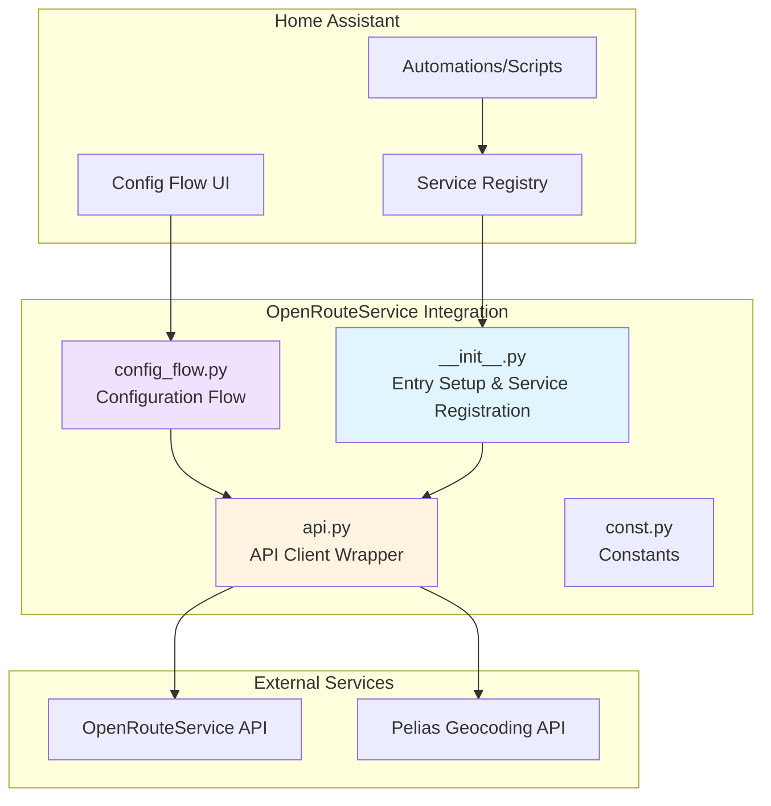

## Component Structure

### File Organization

```
custom_components/openrouteservice/
├── __init__.py          # Integration entry point, service registration
├── manifest.json        # Integration metadata
├── const.py            # Constants and configuration
├── config_flow.py      # UI configuration flow
├── api.py              # Async API client wrapper
├── services.yaml       # Service documentation
└── translations/
    └── en.json         # English translations
```

### Component Relationships

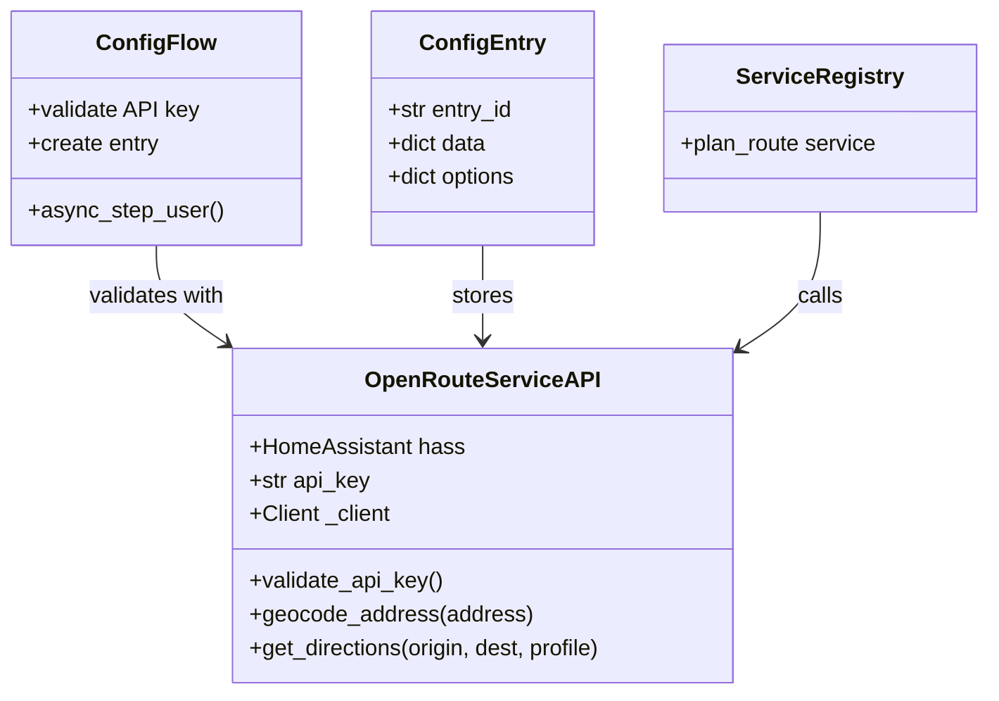

## Service Call Flow

### Route Planning Service

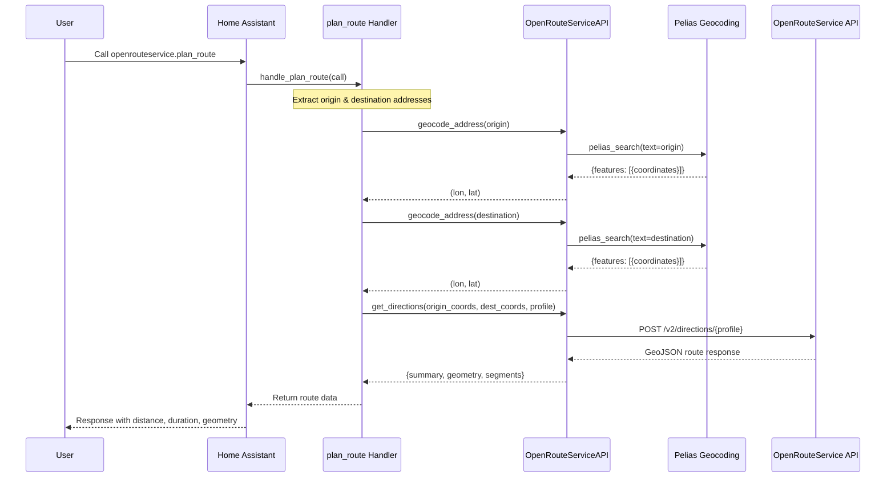

## Data Flow

### Configuration Setup Flow

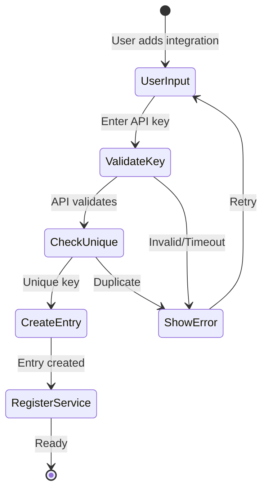

### Service Execution Flow

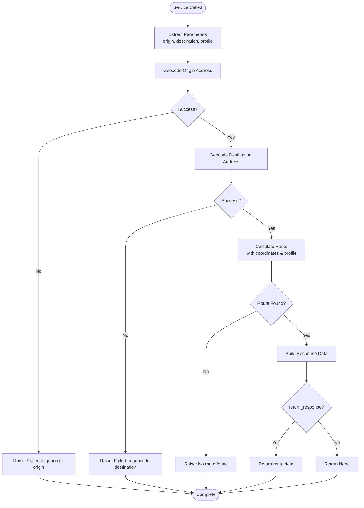

## API Client Design

### Async/Sync Pattern

The OpenRouteService Python library is **synchronous**, so we use the executor pattern to wrap blocking calls:

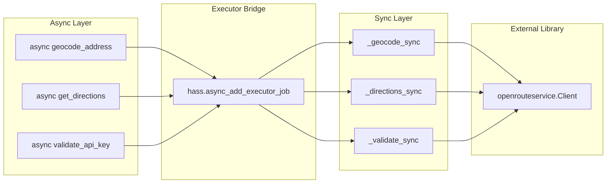

**Pattern Details:**
- Every public method is `async`
- Each async method calls `hass.async_add_executor_job()` with a sync helper
- Sync helpers (`_*_sync`) do the actual blocking I/O with the library
- This keeps the Home Assistant event loop responsive

## Configuration Management

### Entry Data Structure

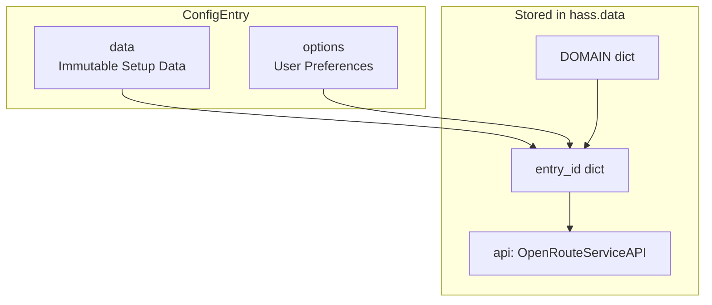

**Current Phase 1:**
- `data`: Contains `api_key` only
- `options`: Empty (Phase 2 will add cache config, units, etc.)

**Future Phase 2:**
- `options`: Will contain cache TTL, default units, default language, etc.

## Service-Only Design Rationale

### Traditional vs Service-Only Approach

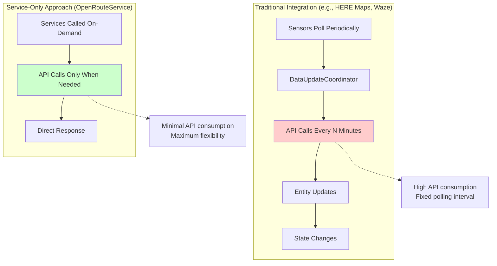

**Benefits:**
1. **Minimal API Consumption**: No background polling, only on-demand
2. **Flexibility**: Addresses provided dynamically in automations
3. **Free Tier Friendly**: Critical for OpenRouteService's rate limits
4. **Simple Architecture**: No coordinator, no entities, no state management

## Error Handling Strategy

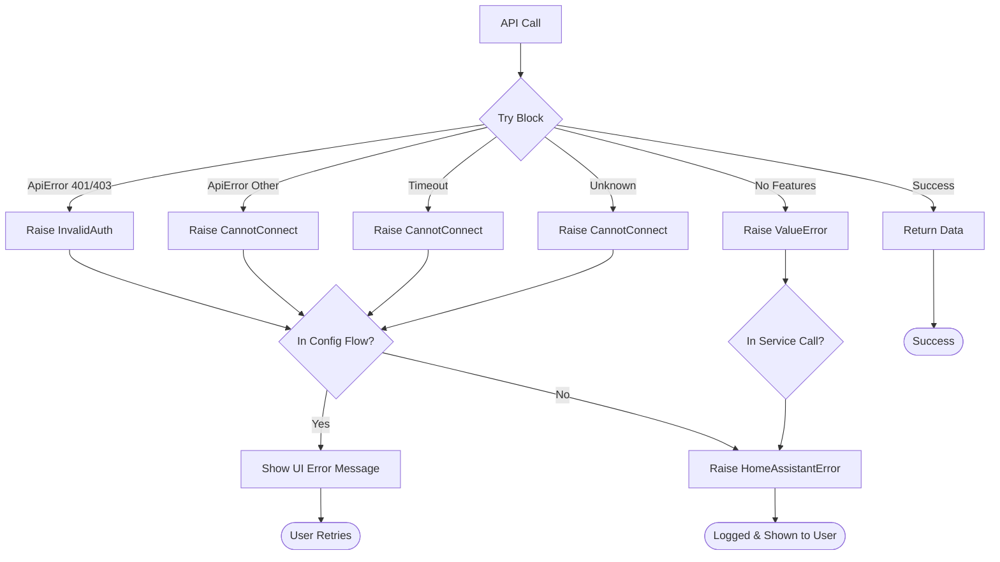

**Exception Hierarchy:**
- `InvalidAuth`: Invalid API key (401/403)
- `CannotConnect`: Network/API errors
- `ValueError`: Data validation errors (no geocoding results, no route)
- `HomeAssistantError`: Wrapper for service call errors

## Key Design Patterns

### 1. Single Service Registration

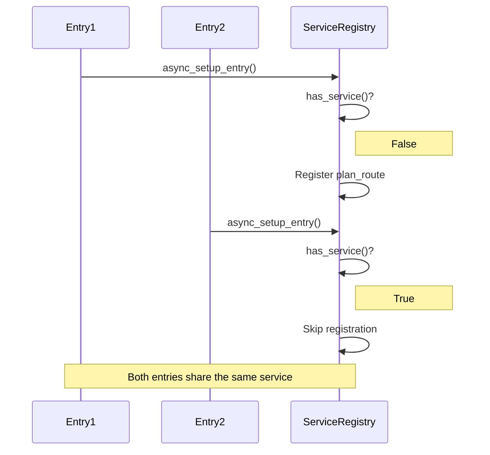

**Implementation:**
```python
if not hass.services.has_service(DOMAIN, SERVICE_PLAN_ROUTE):
    hass.services.async_register(...)
```

### 2. Coordinate Order Convention

⚠️ **Critical:** OpenRouteService uses `[longitude, latitude]` order (NOT `[latitude, longitude]`)

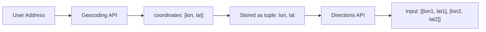

**Always:**
- Store as `(longitude, latitude)` tuples
- Convert to `[[lon, lat], [lon, lat]]` for API calls
- Never swap the order

### 3. Service Response Pattern

```python
if call.return_response:
    return {
        "origin": {...},
        "destination": {...},
        "distance": ...,
        "duration": ...,
        "geometry": ...,
        "segments": ...,
    }
return None
```

Supports `response_variable` in automations for programmatic route data access.

## Integration Lifecycle

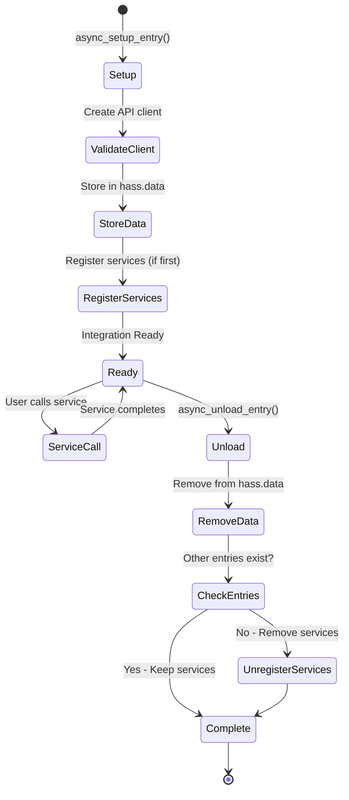

## Future Phase 2 Architecture

Phase 2 will add:

1. **Cache Layer** (`cache.py`)
   - Separate geocoding cache and route cache
   - Configurable TTL for each
   - Persistent storage

2. **Options Flow**
   - Cache duration configuration
   - Units (metric/imperial)
   - Language preferences

3. **Clear Cache Service**
   - Manual cache management

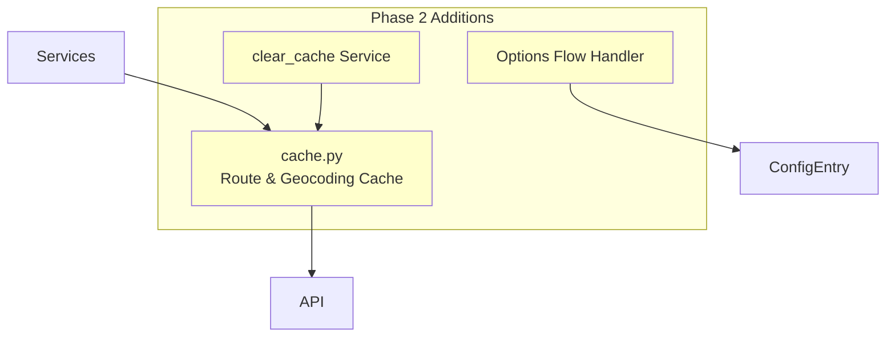

## Testing Architecture

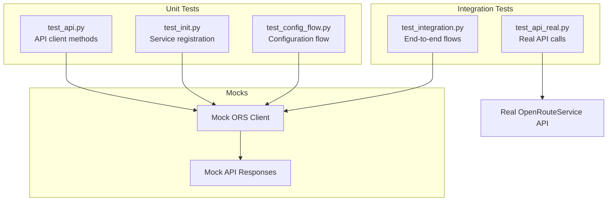

**Test Strategy:**
- Unit tests use mocked OpenRouteService client
- Integration tests verify complete flows with mocks
- Real API tests (manual/optional) validate against live API
- All async code tested with pytest-homeassistant-custom-component

## API Rate Limiting Strategy

OpenRouteService free tier has rate limits. Our service-only approach minimizes consumption:

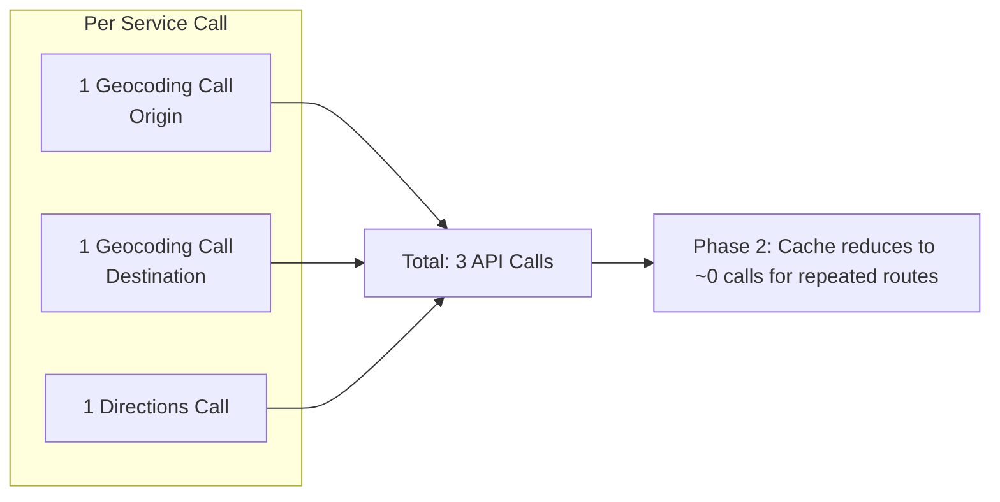

**Phase 2 Caching** will drastically reduce API calls for repeated routes.

## Security Considerations

1. **API Key Storage**: Stored in ConfigEntry data (encrypted by HA)
2. **No Secrets in Logs**: API key never logged
3. **User Input Validation**: All service parameters validated with voluptuous
4. **Error Sanitization**: API errors sanitized before showing to user
5. **HTTPS Only**: All API calls over HTTPS

## Performance Characteristics

- **Service Call Latency**: ~2-5 seconds (2 geocoding + 1 routing call)
- **Memory Footprint**: Minimal (no stored state, no entities)
- **CPU Usage**: Low (I/O bound operations in executor)
- **Network**: 3 HTTPS requests per service call (Phase 1)

## Attribution Requirements

Per OpenRouteService free tier terms:

> © openrouteservice.org by HeiGIT | Map data © OpenStreetMap contributors

Documented in README and noted during configuration.

## References

- [OpenRouteService API Documentation](https://openrouteservice.org/dev/#/api-docs)
- [Home Assistant Integration Documentation](https://developers.home-assistant.io/docs/creating_integration_manifest)
- [HACS Requirements](https://hacs.xyz/docs/publish/integration)
- Research Document: `thoughts/shared/research/2025-11-11-hacs-openrouteservice-integration.md`
- Phase 1 Plan: `thoughts/shared/plans/2025-11-12-openrouteservice-phase1.md`
